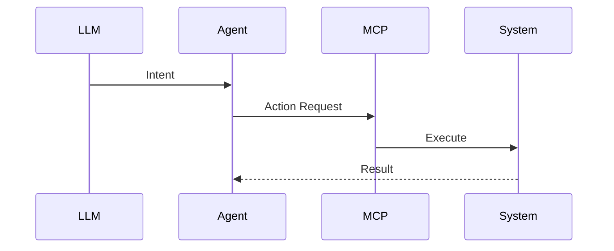

# Architecture: AI-Assisted DevSecOps MCP Agent

## System Diagram
The following Mermaid.js sequence diagram maps the core workflow and interactions:




## What is MCP?
The **Model Context Protocol (MCP)** is an open standard created by Anthropic that allows LLM applications to connect to external data sources and tools. Think of it as a USB-C port for AI — a universal interface that any LLM client can plug into.

## Why MCP Over a REST API?
A REST API requires each LLM client to build custom integrations. MCP provides a **standardized tool interface** that any MCP-compatible client (GitHub Copilot, Claude Desktop, Cursor, etc.) can immediately discover and use. The LLM sees the tool descriptions and input schemas, then decides when and how to call them.

## Tool Architecture

### 1. Pipeline Status (`pipeline.tool.ts`)
Simulates querying the GitHub Actions API. Returns structured pipeline run data including branch, status, commit SHA, and duration. The LLM can use this to answer questions like "Why did the last deploy fail?" or "Is main green?"

### 2. Vulnerability Triage (`vulnerability.tool.ts`)
Simulates a vulnerability tracking board (Jira/Snyk). Returns CVEs ranked by severity with package details, fix versions, and assignment status. Enables the LLM to prioritize remediation: "What critical CVEs are unassigned?"

### 3. Log Search (`logs.tool.ts`)
Simulates querying a centralized logging system (ELK/Datadog). Supports filtering by service, log level, and keyword search. Enables incident investigation: "Show me all errors from payment-service."

### 4. Dependency Scan (`dependency.tool.ts`)
Simulates scanning a project's dependency tree. Returns packages with known vulnerabilities, their severity, and upgrade paths. Enables proactive security: "What dependencies need urgent upgrades?"

## Data Flow
```
User Prompt → LLM Client → MCP Protocol → This Server → Tool Handler → Mock Data → Response → LLM Reasoning → User Answer
```

The key insight is that the LLM **reasons over the structured data** returned by the tools. It doesn't just parrot back results — it correlates information across tools (e.g., linking a pipeline failure to a CVE in a dependency).
